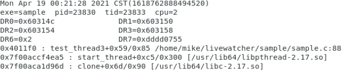

# livewatcher

## background

In c/c++ programs, memory corruption is a common kind of problem. In general, the difficulty lies in finding when and where the memory is corrupted. the `watch` command of `GDB` is useful when the problem is easy to reproduce. Otherwise we need to find other solutions. There are some solutions like `mprotect`, `address sanitizer`. Here is another one.

## implemention

Some CPUs provide special registers for breakpoints. The x86 architecture provides debug registers. we could ues them to set breakpoints for some memory  addresses and exceptions will be triggered when they are accessed.

Livewatcher consists of three parts:

- `livewatcher.stp`    `stap` compiles it to a kernel module and it runs in kernel space. it hooks several functions to set breakpoints and handle exceptions.
- `liblivewatcher`   it provides userspace API to set breakpoints.
- `watch.py`      it is an optional tool to use livewatcher.

## usage

```
WARNING: The project is under development. Dead lock may occur in kernel. Try it in test environment.
```

1. Install `systemtap` and `debuginfo` referring to [this wiki](https://sourceware.org/systemtap/wiki). Here is my system information.

   ```
   [root@mao /]# cat /proc/cpuinfo | grep "model name" | uniq
   model name	: Intel(R) Core(TM) i5-2450M CPU @ 2.50GHz
   [root@mao /]# cat /etc/redhat-release
   CentOS Linux release 7.9.2009 (Core)
   [root@mao /]# uname -a
   Linux mao 3.10.0-1160.el7.x86_64 #1 SMP Mon Oct 19 16:18:59 UTC 2020 x86_64 x86_64 x86_64 GNU/Linux
   [root@mao /]# stap --version
   Systemtap translator/driver (version 4.0/0.176, rpm 4.0-13.el7)
   Copyright (C) 2005-2018 Red Hat, Inc. and others
   This is free software; see the source for copying conditions.
   tested kernel versions: 2.6.18 ... 4.19-rc7
   enabled features: AVAHI BOOST_STRING_REF DYNINST BPF JAVA PYTHON2 LIBRPM LIBSQLITE3 LIBVIRT LIBXML2 NLS NSS READLINE
   ```

2. Build and install `liblivewatcher` 

   ```
   [root@mao livewatcher]# make && make install
   ```

3. Refer to the comments in`livewatcher.h`  and the sample code，set break points on memory  addresses which may be corrupted

4. Compile source code with `-g` 

   ```
   [mike@mao livewatcher]$ make sample
   ```

5. Use `watch.py` to start `livewatcher.stp`  

   ```
   [root@mao livewatcher]# ./watch.py -p ./sample/sample 
   stap -g -d /samba/livewatcher/sample/sample --ldd /samba/livewatcher/livewatcher.stp
   loading...
   livewatcher start...
   >>
   ```
   
6. Run the program and  `livewatcher.stp` prints backtraces when breakpoints are accessed.

   ```
   [mike@mao livewatcher]$ ./sample/sample
   ```

   

## options

### watch.py

`addr2line`     If `livewatcher.stp` is started by `  watch.py` , `  watch.py` deals with the output of `livewatcher.stp`.  This option makes `watch.py` use `addr2line` to get detailed information about backtraces.

example:

```
[root@mao livewatcher]# ./watch.py -p ./sample/sample --addr2line
```

### livewatcher.stp 

At the beginning of the code,  there are two macro definitions:

`STAP_USE_PTRACE_PEEKUSR`    It could be 0 or 1.  When it is 1,  `livewatcher.stp` uses  `stap_arch_ptrace` and `get_user` to read the value of debug registers. Otherwise,  `livewatcher.stp` uses different code for diffrent kernel version to do this. This may cause compatibility issues. It is recommended to set it to 1.

 `STAP_SYNC_HWBP`   After setting a breakpoint,  `livewatcher.stp`  needs to synchronize it to all other threads. It sets the debug register directly for the threads which runs on the current CPU. There are several methords to do it with the threads which run on other CPUs.

- `LW_SYNC_DIRECT`  set the debug register directly.
- `LW_SYNC_SIGALL`  send SIGUSR1 to threads which runs on other CPUs and set debug registers in the signal handler.
- `LW_SYNC_LOCKRQ`   lock the runqueue and set the debug register directly if the thread is not running, or send `SIGUSR1 `
- `LW_SYNC_SIGRUN`   set the debug register directly if the thread is not runable, or send `SIGUSR1 `
- `LW_SYNC_SINGLESTEP`  set `EFLAGS` to raise `SIGTRAP` , set debug registers  and reset `EFLAGS`  in the signal handler

`livewatcher.stp`  creates several  files in procfs after it starts.

```
//the path name is random
/proc/systemtap/stap_566c2a9eec2e0339f15dd6a2dd39a559__3314
[mike@mao stap_566c2a9eec2e0339f15dd6a2dd39a559__3314]$ ls
lw_ignore_hwbp_sigtrap  lw_record_watcher  lw_runtime  lw_ubacktrace_detail
[mike@mao stap_566c2a9eec2e0339f15dd6a2dd39a559__3314]$ 
```

`lw_ignore_hwbp_sigtrap`     whether to ignore the SIGTRAP signal which caused by debug registers. 

`lw_record_watcher`    whether to record backtraces where the breakpoints are set. 0 means disable. A positive number means the limitation of the callstack level.  A negative number means that there is no limit.

`lw_runtime`    show some runtime information about  `livewatcher.stp`.

`lw_ubacktrace_detail`    whether to show  detailed information about backtraces.